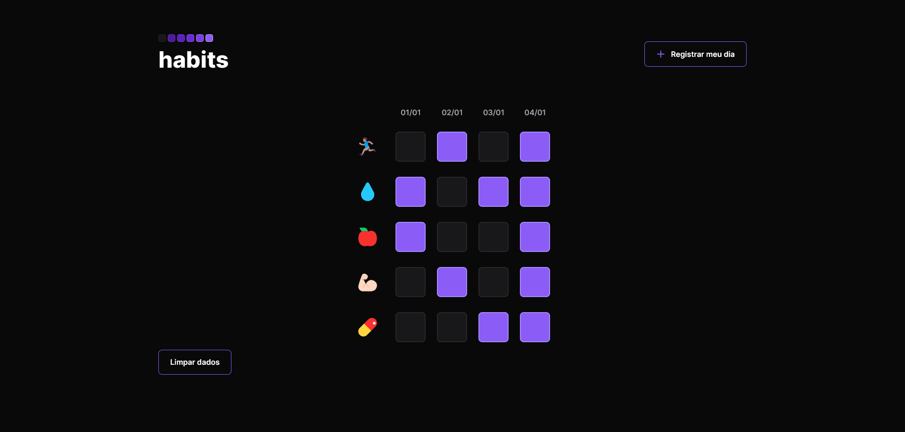

<h1 align=center>Habit Tracker</h1>

Projeto feito baseado na NLW Setup, promovida pela <strong><i>Rocketseat</i></strong>.

---

---

### Tecnologias utilizadas

Para este projeto, foram utilizadas as seguintes tecnologias:
* HTML
* CSS
* JS (vanilla)

O *template* para este projeto pode ser encontrado <a href="https://www.figma.com/file/3esHAQMFvP3zNrRGdOe0v8/Habits-(e)-(Community)?node-id=75%3A567&t=Nrsg2BcEBmvp4Qed-0" target="_blank">clicando aqui.</a>

E o preview do projeto pode ser acessado <a href="https://caiocouto.github.io/habit-tracker/" target="_blank">clicando aqui.</a>
